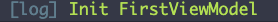
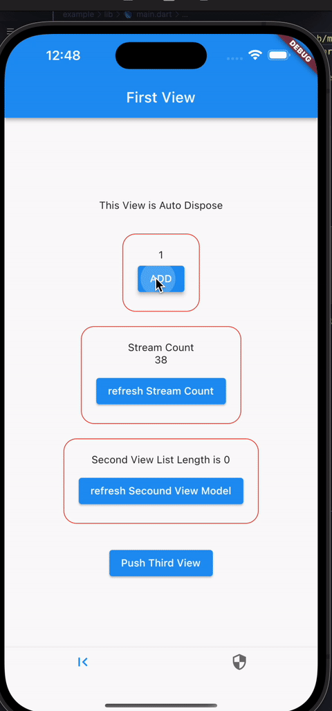

<!--
This README describes the package. If you publish this package to pub.dev,
this README's contents appear on the landing page for your package.

For information about how to write a good package README, see the guide for
[writing package pages](https://dart.dev/guides/libraries/writing-package-pages).

For general information about developing packages, see the Dart guide for
[creating packages](https://dart.dev/guides/libraries/create-library-packages)
and the Flutter guide for
[developing packages and plugins](https://flutter.dev/developing-packages).
-->


# Purpose

Easy to use awesome package [Riverpod](https://pub.dev/packages/flutter_riverpod) for some design pattern  
I created this package to use Riverpod's Provider like the ListView and PageView widgets that are implemented in the Flutter standard.We believe that someone with experience in Flutter development can handle it easily.  


## View (builder)

``` dart
  @override
  Widget build(BuildContext context) {
    // wrap this buider 
    return RiverpodBuilder(
      // set use provider
      provider: firstViewModelProvider,
      builder: (context, ref, vm, state, reader) {
        return Scaffold(
          appBar: AppBar(
            title: const Text('First View'),
            automaticallyImplyLeading: false,
          )
          ...
```

### arguments

| name | mean |
| :--- | :--- |
|`provider`| riverpod provider |
|`builder`| use it like a ListView or PageView|
|`showlog`  |setting whether to display the Log |

### builder  property

| name | mean |
| :--- | :--- |
|`context`| means Build Context|
|`ref`| means WidgetRef|
|`vm` (notifier) |ref.watch(provider.notifier);|
|`state` |ref.watch(provider);|
|`reader` |ref.read(provider.notifier);|

### log



## View Model

``` dart
class FirstViewModel extends BaseViewModel<FirstViewState> {
  @override
  get instanse => const FirstViewState();

  int get count => state.count;

  // listen other provider
  SecondViewModel get secondVM =>
      widgetRef.read(secondViewModelProvider.notifier);

  @override
  void onInit() async{
    // Asynchronous processing is also possible .
    await Future.delayed(const Duration(seconds: 1));
    super.onInit();
  }

  void addCount() {
    state = state.copyWith(count: state.count + 1);
  }

  void showNextView() {
    // has context(Build Context)
    // no arguments need to be passed.
    Navigator.of(context).pushNamed("second_view");
  }

  ...
```

### property

| name | mean |
| :--- | :--- |
|`context`| means Build Context|
|`ref`| means PrividerRef|
|`widgetRef` |means WidgetRef|
|`state` |this state|

### method

| name | mean |
| :--- | :--- |
|`onInit`|call when this class init. (Asynchronous processing is also possible)|
|`onDispose`|call when this class close.|
|`refreshProvider` |use invalidate(refresh) other provider.|

# Preview





# Status of support Providers type
※ This package requires **Riverpod 2 or higher**.  

## corresponding

| builder | provider type | BaseVM|
| :--- | :--- | :--- |
|`RiverpodBuilder`| NotifierProvider | BaseViewModel |
|`KeepRiverpodBuilder`|AutoDisposeNotifierProvider| KeepBaseViewModel |

currently we offer two types of builder.  
We plan to increase the types of providers supported and adapte to hooks  in the near future.

## supplementary information
We know that many people use **stateNotifierProvier** in this case.  
However, since the Riverpod developers [recommend](https://docs-v2.riverpod.dev/docs/providers/state_notifier_provider) the use of **NotifierProvider**, we decided to be the first to respond.

## Extended package
Extending this package is very easy.  
ex : `The case where you want to define common Methods that you want to use in all VM...`  
- In that case, create an extension class for `InnerViewModel` after defining other providers..

``` dart
import 'package:fluttertoast/fluttertoast.dart';

extension InnerViewModelEXT on InnerViewModel {

  // OverlayLoadingView.provider = provider to manage loading

  bool get isLoading => providerRef.read(OverlayLoadingView.provider);

  // show Loading
  void showLoading() {
    providerRef.read(OverlayLoadingView.provider.notifier).show();
  }

  // hide Loading
  void hideLoading() {
    providerRef.read(OverlayLoadingView.provider.notifier).hide();
  }

  void showAlert(String message) {
    // alert method
  }

  void showToast(String message) {
    // other packages can be defined and used here as well.
    Fluttertoast.showToast(
        msg: message, toastLength: Toast.LENGTH_SHORT, timeInSecForIosWeb: 1);
  }
}

```
***
Writing Documents more detail...


